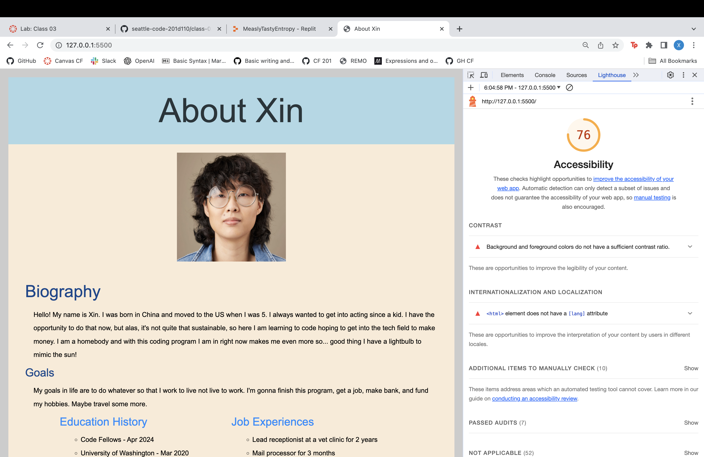
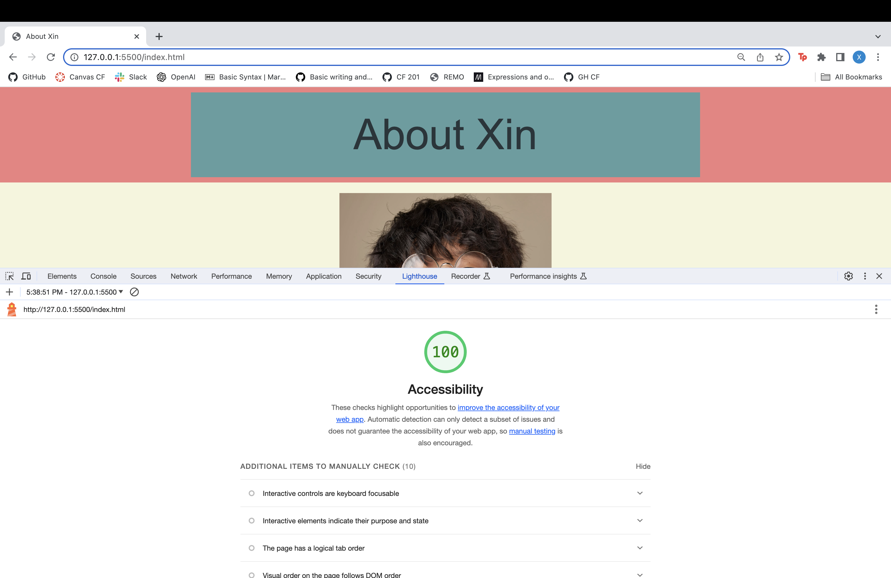

# Lab 2, 3, 4

## About Me Pt.1 (HTML/CSS/JS)

Build out an “About Me” webpage that quizzes the user on fun facts gives the user some basic information about who you are and where you came from.

### Author: Xin Deng

### Links and Resources

1. [Setting Up a New Code 201 Project](https://codefellows.github.io/code-201-guide/curriculum/class-02/project-setup)

### Lighthouse Accessibility Report Score

### Reflections and Comments

1. How did this go, overall?
    - I was so stressed. I feel like I'm getting ahead of myself for sure like adding stuff that wasn't required and if I mess those up, the entire thing is a mess and I spend too much time fixing it. I need to slow down.

2. What observations or questions do you have about what you’ve learned so far?
    - I really don't know to be honest. Lectures feel really scattered and I feel like I have to self-teach or get other students to explain again during remo.

3. How long did it take you to complete this assignment? And, before you started, how long did you think it would take you to complete this assignment?
    - Almost 7 hours. That is too long. I had to idea how long it would take me, but I know that is too long.

## About Me Pt.2 (Loops/Conditionals)

Additional functionality added to your About Me Guessing Game. A "Top Ten" favorites list is added. Sixth question added so user can guess a number with only four tries given. Seventh question added with multiple answers in an array with six tries given to the user. 

### Author: Xin Deng

### Links and Resources

1. [Setting Up a New Code 201 Project](https://codefellows.github.io/code-201-guide/curriculum/class-02/project-setup)

### Lighthouse Accessibility Report Score

### Reflections and Comments

1. How did this go, overall?
     - Less stressful then yesterday because we only had to deal with 2 additional questions while yesterday we had to start from scratch including creating and setting up pages which took time. I still do not understand CSS formatting that well.
     
2. What observations or questions do you have about what you’ve learned so far?
    - I do not full understand CSS and why things won't work. I cannot figure out how to put border lines around my sections. For today JS was easier than CSS which is wild.

3. How long did it take you to complete this assignment? And, before you started, how long did you think it would take you to complete this assignment?
    - Five hours and I thought I would take as long as yesterday. I shaved two hours down which is a win.

## About Me Pt.3 (Functions/Pair Programming)

Additional functionality added to your About Me Guessing Game. A "Top Ten" favorites list is added. Sixth question added so user can guess a number with only four tries given. Seventh question added with multiple answers in an array with six tries given to the user. 

### Author: Collaborative project between me and Lou Escobar for pair programming

### Links and Resources

1. [Setting Up a New Code 201 Project](https://codefellows.github.io/code-201-guide/curriculum/class-02/project-setup)

### Lighthouse Accessibility Report Score

### Reflections and Comments

I was Navigator on: [My about me project](https://github.com/xind14/CF201-about-me-project/pull/1)
I was Driver on: [Lou's about me project](https://github.com/Lefty8969/Projectlabscf/pull/1)

- How did the pair programming process go in general?
    - It went well. I don't know if we were suppose to do this, but once the driver got the pattern of what the navigator wanted, it became faster after that where the driver was just typing and the navigator just watched for incorrect syntax or errors. I was also able to help my partner by noticing missing lab requirements and helping him with that.

- Did you learn anything from your partner? If so, what?
    - I didn't learn a coding specific thing from him aside from the fact that he likes softball and has a dog. But I learned from this whole pair programming exercise on how to not take complete control. For example: when Lou misspelled something or syntax he wrote was wrong, I wanted to be like "you spelled function wrong" or "the function needs a ()" instead I would just say "the syntax for function is incorrect" and allow him to fix the mistake.
- What was the most difficult part of the assignment today?
    - Forgetting to do the steps in order. We would forget a certain step and thought we were done. For example: we both forgot that after the pull request was merged we had to still pull it from remote to local. We would also forget to commit after each question sometimes because we're not use to committing so often in our own projects.

- What was the easiest part of the assignment today?
    - Creating a function to just wrap it around the logic and variables that was already written.

- Anything else you’d like to share?
    - We both were able to communicate well through this, so I wonder what it'll be like to work with someone who is more difficult.

- How long did it take you to complete this assignment? And, before you started, how long did you think it would take you to complete this assignment?
    - It took around 3 hours maybe. I had a feeling this lab was going to be shorter because we already had existing code written, it was just creating functions to go around those codes. So an hour and a half to complete my portion which is definitely shorter then all the other times I've taken for my labs.
